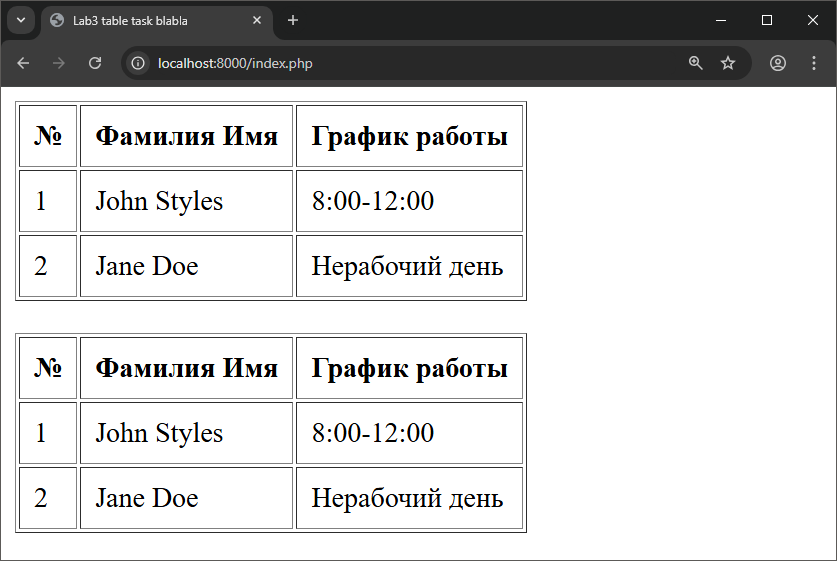
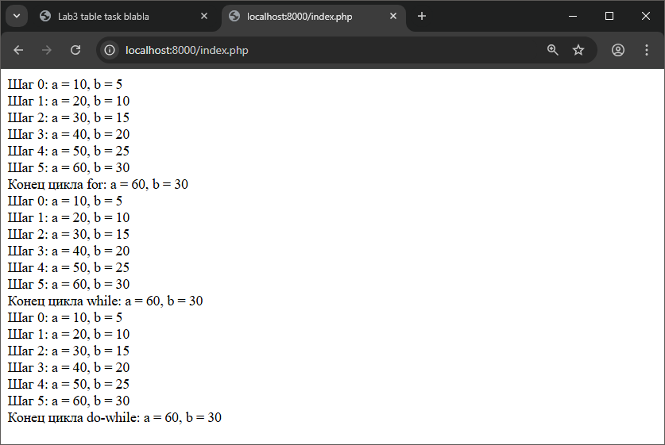

# Лабораторная работа №3. Управляющие конструкции

__Студент:__  *Пармакли Леонид IA2404ru*  
__Преподаватель лабораторных работ:__  *Вишневский Борис*  
__Преподаватель курса:__  *Нартя Никита*  


---
## Цель работы
- Изучить устройство условного опертора if и if-else, а также изучить циклы for while и do-while


---
## 1. Условия
- Используя функцию date(), создайте таблицу с расписанием, формируемым на основе текущего дня недели.

```php
<?php

$day = date('N');

function getJohnSchedule($day) 
{
    if ($day % 2)
        return "8:00-12:00";

    return "Нерабочий день";
}

function getJaneSchedule($day) 
{
    if (!($day % 2)) 
        return "12:00-16:00";
    
    return "Нерабочий день";
}

function getSchedule($name) 
{
    $localDay = date('N'); 

    switch ($name) 
    {
        case "John Styles":
            switch ($localDay) 
            {
                case 1:
                case 3:
                case 5:
                    return "8:00-12:00";

                default:
                    return "Нерабочий день";
            }

        case "Jane Doe":
            switch ($localDay) 
            {
                case 2:
                case 4:
                case 6:
                    return "12:00-16:00";

                default:
                    return "Нерабочий день";
            }

        default:
            return "Сотрудник не найден";
    }
}

?>
```





---
## 2. Циклы

### 2.1 Цикл for
```php
$a = 0;
$b = 0;

for ($i = 0; $i <= 5; $i++) 
{
   $a += 10; $b += 5;
   echo "Шаг $i: a = $a, b = $b <br/>";
}

echo "Конец цикла for: a = $a, b = $b <br/>";
```

### 2.2 Цикл while

```php
$a = 0;
$b = 0;
$i = 0;

while ($i <= 5) 
{
    $a += 10; $b += 5;
    echo "Шаг $i: a = $a, b = $b <br/>";
    $i++;
}

echo "Конец цикла while: a = $a, b = $b <br/>";
```

### 2.3 Цикл do-while

```php
$a = 0;
$b = 0;
$i = 0;

do 
{
    $a += 10; $b += 5;
    echo "Шаг $i: a = $a, b = $b <br/>";
    $i++;
} 
while ($i <= 5);

echo "Конец цикла do-while: a = $a, b = $b  <br/>";
```



---
## 3. Контрольные вопросы

### 1. Разница между for, while и do-while

- for является циклом со счетчиком, выполняемым известное количество раз.
- while является циклом, выполняемым только при истинном условии, используется когда количество итераций неизвестно. Сначала проверка, потом выполнение.
- do-while является циклом, выполняемым минимум один раз, Сначала выполнение, потом проверка.

### 2. Как работает тернарный оператор ? :

- Тернарный оператор является сокращенной формой if-else
    ```
    условие ? значение_если_true : значение_если_false;
    ```

### 3. Что произойдет, если в do-while условие изначально ложно?

- Тело цикла выполнится минимум 1 раз, так как сначала выполнится блок do, затем выполнится проверка условия
