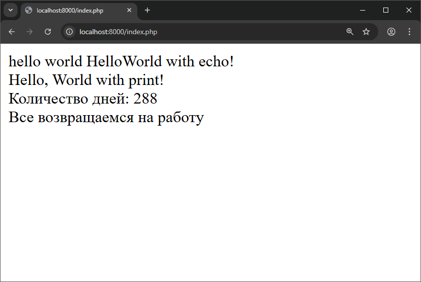
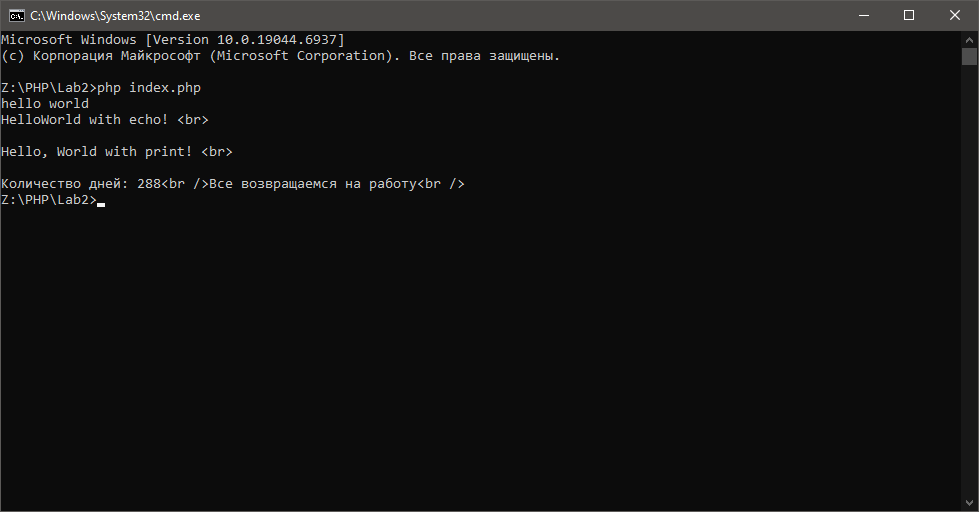

# Лабораторная работа №2. Установка и первая программа на PHP

__Студент:__  *Пармакли Леонид IA2404ru*  
__Преподаватель лабораторных работ:__  *Вишневский Борис*  
__Преподаватель курса:__  *Нартя Никита*  


---
## Цель работы
- Целью данной лабораторной работы является установка и настройка среды разработки для работы с языком программирования PHP, а также создание первой программы на PHP.


---
## Шаг 1: Установка PHP

Был выбран ручной способ установки. 
- Скачивание с оф. сайта архива.
- Распоковка в нужную мне папку.
- Добавление переменной среды в систему.
- Выполнение команды `php -v`

---
## Шаг 3 - 5. Написание первой PHP-программы

- Для вывода доступно две команды: `echo` и `print`

- Конкатенация строк происходит при помощи `.`

- Вывод можно делать несколькими вариантами:
    - Вывод с использованием конкатенации
    ```php
    <?php
        echo "Количество дней: " . $days . "<br />";
        echo $message . "<br />";
    ?>
    ```

    - Вывод с использованием двойных кавычек
    ```php
    <?php
        echo "Количество дней: $days<br />";
        echo "$message<br />";
    ?>
    ```

    - Вывод с использованием фигурных скобок
    ```php
    <?php
        echo "Количество дней: {$days}<br />";
        echo "{$message}<br />";
    ?>
    ```

- Для перехода на новую строку используется либо `'\n'` либо `<br/>`.
    - `'\n'` используется для вывода в коммандной строке.
    - `<br/>` используется для вывода в браузере.

- Стоит отметить что результат работы PHP-кода является HTML-код с последующим выводом в браузер, поэтому `<br/>` в командной строке будет выводиться как текст

- Также, для перехода на новую строку можно использовать PHP_EOL (корректный символ перевода строки для текущей ОС).


## Итоговый код


```php
<?php

echo "hello world\n";
echo "Hello", "World with echo! <br>\n" . PHP_EOL;
print "Hello, World with print! <br>\n" . PHP_EOL;

$days = 288;
$message = "Все возвращаемся на работу";

echo "Количество дней: " . $days . "<br />";
echo $message . "<br />";

?>
```





---
## Контрольные вопросы

1. Какие способы установки PHP существуют?
    - Ручная установка в виде скачивания и распаковки архива со сборкой PHP интерпретора. Требуется добавление пути распаковки в переменные среды ОС
    - Установка инструментов, которые распространяются в виде набора ПО, в который входит и PHP. XAMPP или OpenServer. 

2. Как проверить, что PHP установлен и работает?
    - В командной строке ввести команду `php -v`. Если PHP установлен правильно, выведется версия PHP, в противном случае выйдет ошибка "неизвестная команда".

3. Чем отличается оператор echo от print?
    |                                 | echo            | print             |
    | ------------------------------- | --------------- | ----------------- |
    | Возвращает значение             | нет             | да (возвращает 1) |
    | Можно использовать в выражениях | нет             | да                |
    | Количество аргументов           | несколько       | один              |
    | Скорость                        | немного быстрее | немного медленнее |


