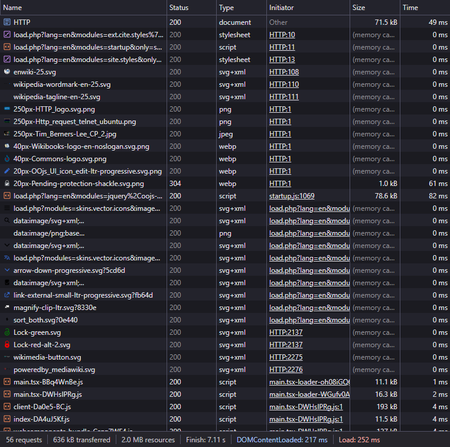

# Лабораторная работа №1: Анализ HTTP-запросов

__Студент:__  *Пармакли Леонид IA2404ru*  
__Преподаватель лабораторных работ:__  *Вишневский Борис*  
__Преподаватель курса:__  *Нартя Никита*  


## Цель работы
- Понять, что происходит при открытии сайта пользователем
- Научиться находить и анализировать HTTP-запросы в браузере
- Разобраться в назначении HTTP-методов GET, POST, PUT, DELETE


---


## Задание 1

```
Method: GET
URL:    https://en.wikipedia.org/wiki/HTTP
Status: 200 Ok
```

Метод GET предназначен для получения данных (ресурсов) с сервера без изменения его состояния. В данном случае происходит загрузка веб-страницы 

### Заголовки запроса:
```
:authority:         en.wikipedia.org
:method:            GET
:path:              /wiki/HTTP
:scheme:            https
accept-encoding:    gzip, deflate, br, zstd
accept-language:    ru-RU,ru;q=0.9,en-US;q=0.8,en;q=0.7
cache-control:      max-age=0
```

### Заголовки ответа:
```
accept-ch
accept-ranges:      bytes
age:                308
cache-control:      private, s-maxage=0, max-age=0, must-revalidate, no-transform
content-encoding:   gzip
content-language:   en
content-type:       text/html; charset=UTF-8
date:               Mon, 09 Feb 2026 18:38:02 GMT
last-modified:      Sun, 08 Feb 2026 16:49:04 GMT
```

### Тело запроса
- отсутствует 

### Тело ответа
- HTML-код страницы Wikipedia

### Дополнительные запросы при загрузке страницы
- Браузер загружает все ресурсы, необходимые для корректного отображения страницы. По этой причине выполняются запросы, для загрузки: CSS-файлов (стили оформления), JavaScript-файлы, изображений, шрифтов, дополнительных API-запросов.

 

### Некорректный URL
Статусом ответа запроса, после перехода по ссылке `https://en.wikipedia.org/wiki/HTTPdsfdfs` является `404 Not Found` из-за того, что страницы с таким адресом не существует на сервере Wikipedia.


---


## Задание 2

Поиск проводился по адресу `https://en.wikipedia.org/wiki/Special:Search`. Для поиска было использовано слово `browser`

```
Request URL:        https://en.wikipedia.org/w/index.php?...
Request Method		GET
Status Code			200 OK
Remote Address		185.15.59.224:443
Referrer Policy		origin-when-cross-origin
```

Параметры запроса: `search=browser title=Special:Search go=Go`

Метод GET используется, потому что поиск не изменяет данные сервера.


---


## Задание 3

При загрузке страницы https://github.com используется метод GET\ и вощвращен статус 200 OK.
Дополнительно загружаются CSS, JS и API-запросы для динамического контента.

```
Request URL:        https://github.com/
Request Method:     GET
Status Code:        200 OK
Remote Address:     140.82.121.4:443
Referrer Policy:    strict-origin-when-cross-origin
```

### Заголовки запроса:
```
:authority:         github.com
:method:            GET
:path:              /
:scheme:            https
accept-encoding:    gzip, deflate, br, zstd
accept-language:    ru-RU,ru;q=0.9,en-US;q=0.8,en;q=0.7
cache-control:      max-age=0
```

### Заголовки ответа:
```
cache-control:      max-age=0, private, must-revalidate
content-encoding:   gzip
content-type:       text/html; charset=utf-8
date:               Wed, 11 Feb 2026 14:18:37 GMT
etag:               W/"777428b8ef4e883ffdbd6784ad99992d"
referrer-policy:    origin-when-cross-origin, strict-origin-when-cross-origin
server:             github.com

```


---


## Задание 4

### GET-запрос

```
GET / HTTP/1.1
Host: sandbox.usm.com
User-Agent: Leonid Parmacli (Windows NT 10.0; Win64; x64) Chrome 142.0.0
```

### Что такое User-Agent

User-Agent - короткая текстовая строка, которую веб-браузер или другое клиентское приложение автоматически отправляет на сервер при каждом HTTP-запросе

### POST-запрос

```
POST /cars HTTP/1.1
Host: sandbox.usm.com
Content-Type: application/x-www-form-urlencoded

make=Toyota&model=Corolla&year=2020
```

### Другие методы HTTP

- GET - получение
- POST - создание
- PUT - полное обновление
- PATCH - частичное обновление
- DELETE - удаление
- HEAD - только заголовки
- OPTIONS - список поддерживаемых методов

### PUT-запрос

```
PUT /cars/1 HTTP/1.1
Host: sandbox.usm.com
User-Agent: Leonid Parmacli (Windows NT 10.0; Win64; x64) Chrome 142.0.0
Content-Type: application/json
```
```json
{ 
	"make": "Toyota", 
	"model": "Corolla", 
	"year": 2021 
}
```

### Разница PUT и PATCH
PUT полностью заменяет ресурс, PATCH изменяет отдельные поля.


### Возможный ответ сервера
- Запрос:
	```
	POST /cars HTTP/1.1
	Host: sandbox.com
	Content-Type: application/json
	User-Agent: John Doe
	model=Corolla&make=Toyota&year=2020
	```

- Ответ:
	```
	HTTP/1.1 201 Created\
	Content-Type: application/json
	```
	```json
	{ 
		"id": 1, 
		"make": "Toyota", 
		"model": "Corolla", 
		"year": 2020 
	}
	```

### Возможные коды ответа
- 200 OK - успешно
- 201 Created - создано
- 400 Bad Request - ошибка данных
- 401 Unauthorized - нет авторизации
- 403 Forbidden - доступ запрещен
- 404 Not Found - ресурс не найден
- 500 Internal Server Error - ошибка сервера


